<div align="center">

# ✈️ Tripify

### *The AI travel teammate that helps groups research, decide, and dynamically replan their trips — together.*

**by Studify** — Tan Sim Po · She Jia Xuan · Chong Wei Xuan

<p>
  <a href="#"></a>
  <a href="#"></a>
  <a href="#"></a>
  <a href="#"></a>
  <a href="#"></a>
  <a href="#"></a>
</p>

<p>
  <a href="#-video--slides">🎬 Video</a>&nbsp;&nbsp;·&nbsp;&nbsp;
  <a href="#-prototype">🎨 Prototype</a>&nbsp;&nbsp;·&nbsp;&nbsp;
  <a href="#table-of-contents">📚 Contents</a>
</p>

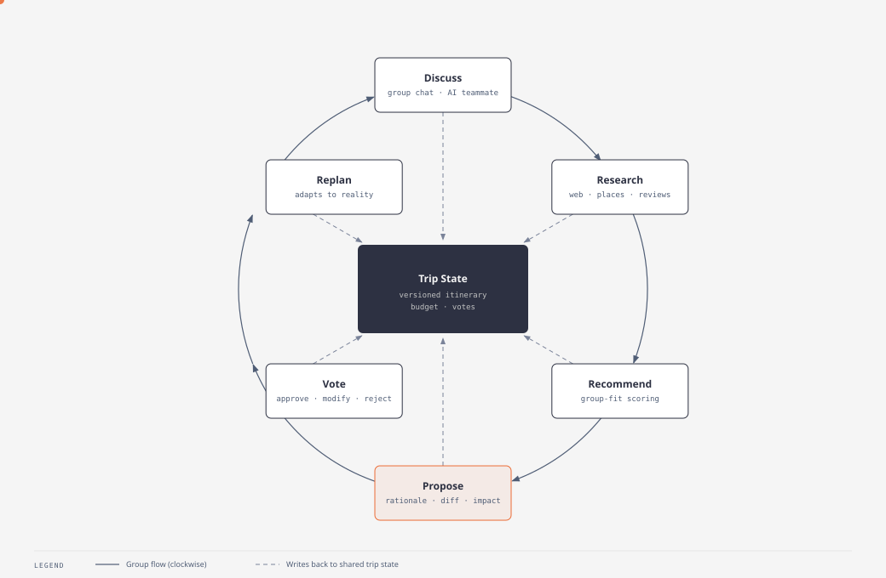

<sub><i>The Tripify decision loop — every pass writes back to one shared, versioned trip state.</i></sub>

</div>

---

## Table of Contents

1. [Overview](#-1-project-overview)
2. [Ideation & Process](#-2-ideation--process)
3. [Design & Prototype](#-3-design--prototype)
4. [What Makes It Different](#-4-what-makes-it-different)
5. [Technical Architecture](#-5-technical-architecture--feasibility)
6. [Team](#-team)

---

## 🧭 1. Project Overview

### The Problem

Planning group trips is inherently a **group decision-making problem**, not a search problem. Today, groups coordinate across WhatsApp, Notion, Google Docs, Maps, and various booking apps. Every member has different budgets, interests, and tolerances — yet there is no single tool that unifies research, discussion, proposal, and execution into one coherent workflow.

**Stakeholders:**

- Travellers (individual and group)
- Group trip organisers (who bear the coordination burden)

**Existing solutions and why they fall short:**

| App | What It Does | Why It Falls Short |
|:---|:-------------|:-------------------|
| **Google Travel** | Generates itineraries from prompts | Solo-focused; no group decision-making; no proposal/vote system |
| **TripIt** | Parses booking emails into an itinerary | Organisational tool only; no research, recommendation, or AI |
| **Traveloka / Klook** | Book flights, hotels, activities | Transactional; no planning, no group coordination |
| **ChatGPT / Notion AI** | Generates text-based itineraries | Stateless; no shared context, no group memory, no proposal system |

<div align="center">

**The gap:** No existing tool treats the group's collective decision-making as the primary interaction model.

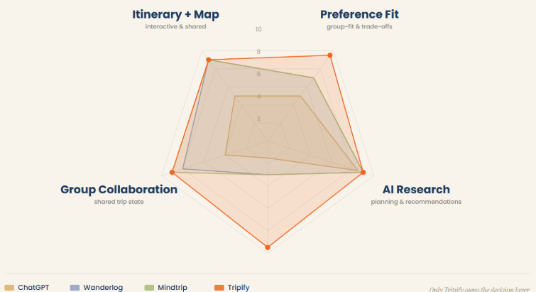

<sub><i>Tripify (orange) is the only tool that covers all five capabilities.</i></sub>

</div>

### Our Solution

> **Tripify is an AI travel teammate** that helps groups research, decide, and dynamically replan their trips together. Instead of generating an itinerary and hoping it works, Tripify listens to group discussions, researches real destinations, proposes changes with clear rationale, and lets members vote — all while adapting when real-world events (flight delays, weather, closures) invalidate plans.

**Feature Set:**

| | Feature | What it does |
|:---:|:--------|:-------------|
| 1 | **Trip Creation** | Set destination, dates, budget, currency, and group size |
| 2 | **Group Members & Preferences** | Each member sets budget, interests, dislikes, walking tolerance, and pace |
| 3 | **Group Chat with AI** | Members discuss naturally; the AI participates as a teammate |
| 4 | **AI Research** | Researches places using web search, Google Places, Reddit, and official sources |
| 5 | **AI Recommendations** | Scores and ranks options by group fit, cost, experience, and convenience |
| 6 | **Proposal System** | AI creates structured proposals; members vote approve/modify/reject |
| 7 | **Proposal Application** | Approved proposals are applied with full version control |
| 8 | **Itinerary Management** | Day-by-day timeline with activities, costs, and travel times |
| 9 | **Map Integration** | Google Maps renders routes, distances, and travel times between activities |
| 10 | **Budget Forecasting** | Real-time budget tracking and AI-powered cost optimisation |
| 11 | **Dynamic Replanning** | Flight delays, weather changes, and closures trigger automatic replanning proposals |
| 12 | **Backup Plans** | Primary activities can have conditional backups (weather, crowd, closure) |
| 13 | **Internationalisation** | English, Chinese, and Malay from day one via next-intl |

<div align="center">

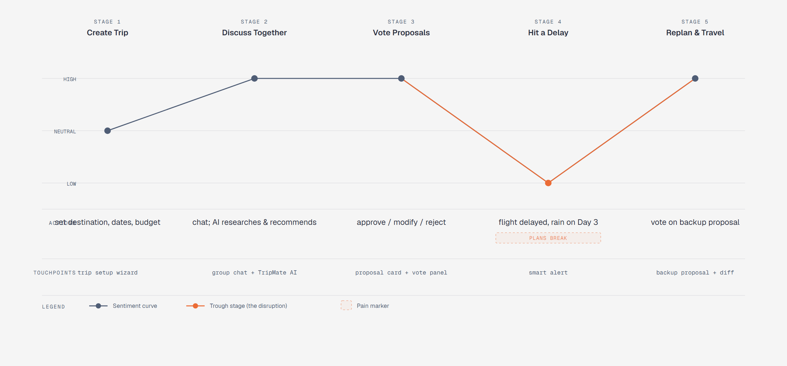

<sub><i>The organiser's journey: even the disruption stage recovers, because replanning is built in.</i></sub>

</div>

<p align="right"><a href="#table-of-contents">↩ Back to top</a></p>

---

## 💡 2. Ideation & Process

### 2.1 Ideas We Considered

| Idea | Why It Was Dropped / Kept |
|:-----|:--------------------------|
| **AI Group Travel Teammate** ✅ *Chosen* | Addresses the root problem: group travel planning is a decision problem, not a search problem. Combines research, recommendation, and group voting. Strong differentiation from existing tools. |
| **AI Trip Expense Splitter** ⏸ *Deferred* | Useful but not the core differentiator. Added as a future feature (expense settlement) but not in MVP scope. |
| **AI Travel Agent with Booking** ❌ *Dropped* | Booking integration adds enormous complexity (payment, API access, compliance) with marginal value for a hackathon. Deferred to post-MVP. |
| **Social Travel Feed** ❌ *Dropped* | Felt like a generic social media app, not a planning tool. Didn't address the coordination problem. |
| **AI Photo Journal** ❌ *Dropped* | Interesting but post-trip; didn't solve the planning problem. |
| **Solo AI Itinerary Generator** ❌ *Dropped* | Already well-served by Google Travel, ChatGPT, and Notion AI. No group decision-making layer. |

### 2.2 Ideation Boards

**Problem Tree — Root Causes of Group Travel Stress**

<div align="center">

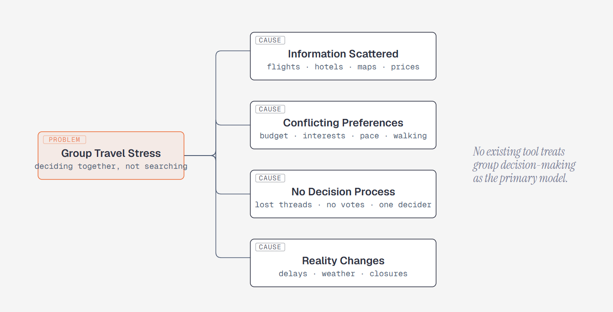

</div>

<details>
<summary><i>Original ASCII version</i></summary>

```
Group Travel Stress
├── Information Scattered
│   ├── Flights in one app
│   ├── Hotels in another
│   ├── Activities on Google Maps
│   └── Prices on booking sites
├── Conflicting Preferences
│   ├── Budgets differ
│   ├── Interests differ
│   ├── Walking tolerance differs
│   └── Pace preferences differ
├── No Shared Decision Process
│   ├── WhatsApp threads get lost
│   ├── No voting mechanism
│   ├── No proposal/rationale
│   └── One person ends up deciding everything
└── Reality Changes
    ├── Flight delays
    ├── Weather changes
    ├── Activity closures
    └── Plans become stale instantly
```

</details>

> *This diagram helped us identify that the core problem isn't "I don't know what to do in Tokyo" — it's "we can't decide together, and our plans break when reality changes."*

---

**User Flow — Core Loop**

<div align="center">

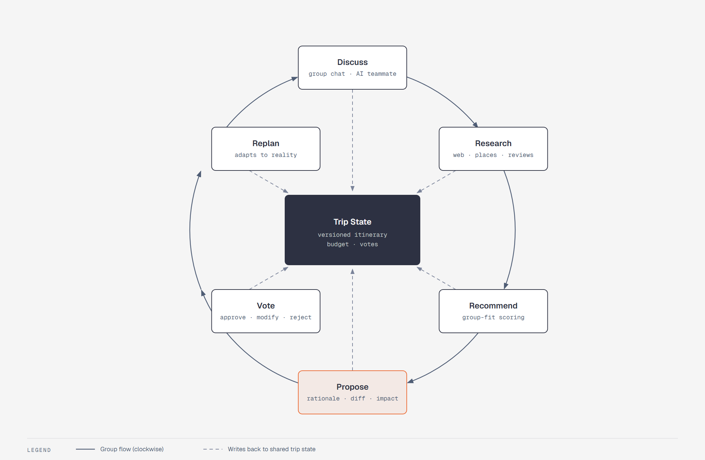

</div>

<details>
<summary><i>Original ASCII version</i></summary>

```
User Creates Trip
      ↓
Adds Members
      ↓
Members Set Preferences
      ↓
Opens Trip Workspace
      ↓
AI Researches Destinations
      ↓
AI Creates Recommendations
      ↓
AI Creates Proposal
      ↓
Group Votes
      ↓
Approved → Itinerary Updates
      ↓
External Event (Flight Delay / Weather)
      ↓
AI Detects Problem
      ↓
AI Researches Alternatives
      ↓
AI Creates Backup Proposal
      ↓
Group Votes Again
      ↓
Trip Continues
```

</details>

> *This flow maps directly to our MVP scope and defines the complete loop we aim to demo.*

### 2.3 Mentor Consultation

| Date | Mentor | Feedback Received | What Was Changed |
|:-----|:-------|:------------------|:-----------------|
| *[Date]* | *[Mentor Name]* | *"Don't try to build booking integration for the hackathon."* | Removed hotel/flight booking from MVP scope. Focused on research and proposal system instead. |
| *[Date]* | *[Mentor Name]* | *"The proposal/vote system is your strongest differentiator — make sure that's polished."* | Prioritised ProposalCard, ProposalDiff, and VotePanel components over Trip Health dashboard. |

<p align="right"><a href="#table-of-contents">↩ Back to top</a></p>

---

## 🎨 3. Design & Prototype

<span id="-prototype"></span>

**UI Prototype:** tripify-agent.vercel.app

### Key Screens

<div align="center">

#### 1. Landing — Your AI Travel Teammate

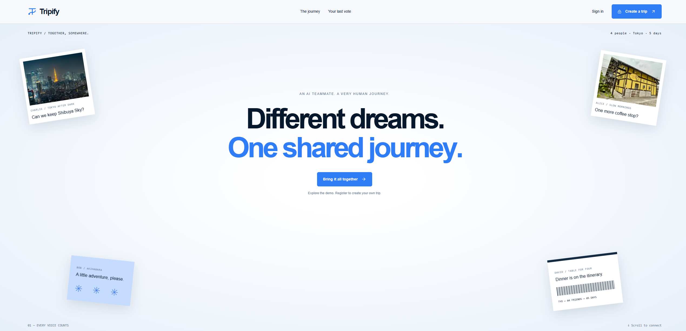

*Tripify introduces itself as an AI travel teammate, not just another booking app. The landing page sets the tone: this is a tool for groups who want to research, decide, and replan together. Clear value proposition from the first screen.*

---

#### 2. Try a Proposal — Vote & Decide ⭐

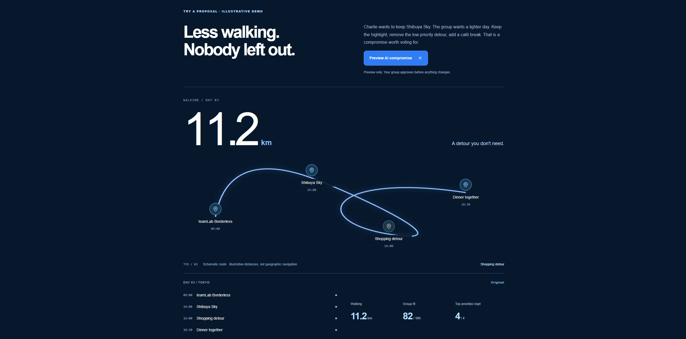

*The proposal system is Tripify's core differentiator. When the AI suggests changes to the itinerary, it creates a structured proposal with clear rationale, visual before/after diffs, and quantified impact metrics. Each group member can vote to approve, modify, or reject. This transforms travel planning from "one person decides everything" to true group decision-making. Approved proposals are applied atomically with full version control, so the AI never works off stale data.*

---

#### 3. Trade-offs Analysis — Transparent Decision Intelligence

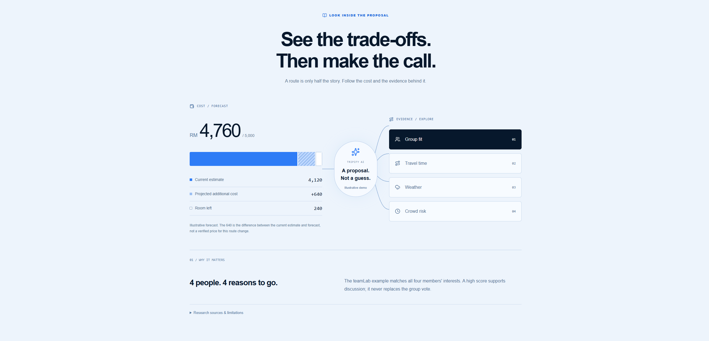

*No group agrees on everything. Tripify's AI analyzes trade-offs across multiple dimensions — cost, walking distance, group fit score, and experience quality — and presents them transparently. This screen shows the AI reasoning about why TeamLab Borderless might be a better choice than Shibuya Sky for THIS group, based on their stated preferences (indoor activities, moderate walking, cultural experiences). The radar chart and impact breakdown help groups make informed decisions based on what matters most to them, not generic popularity rankings.*

---

#### 4. Sign Up — Simple Onboarding

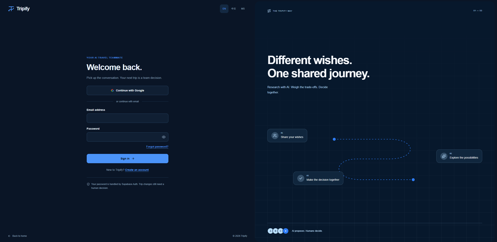

*Authentication is handled by Supabase Auth with a clean, accessible interface. Email/password and social login options make onboarding friction-free. Protected routes ensure that only authenticated users can create trips or join groups.*

---

#### 5. Home — Your Trip Dashboard

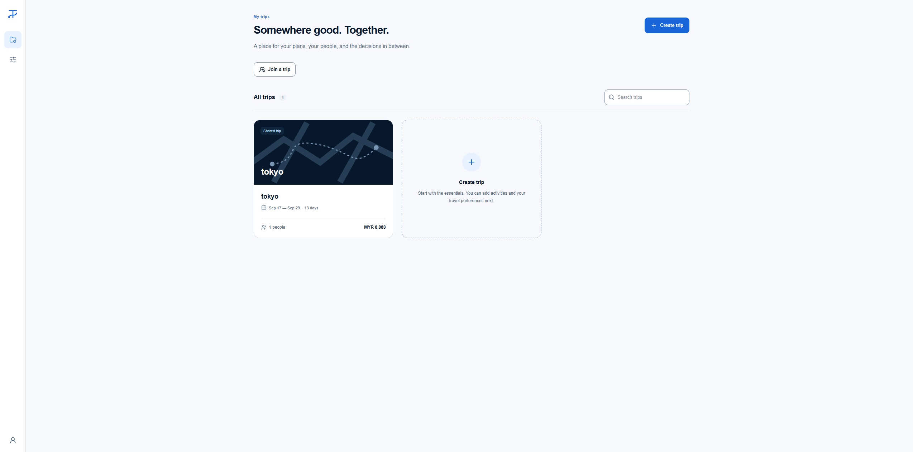

*After logging in, users land on their trip dashboard. This is the central hub where you can see all your trips — active, upcoming, and past. Create a new trip, accept pending invitations, or jump back into an ongoing trip. The home screen shows trip status at a glance: budget progress, dates, member count, and whether there are pending decisions or proposals awaiting your vote. It's designed for quick access and clear status visibility, not information overload.*

---

#### 6. Create a Trip — Set the Foundation

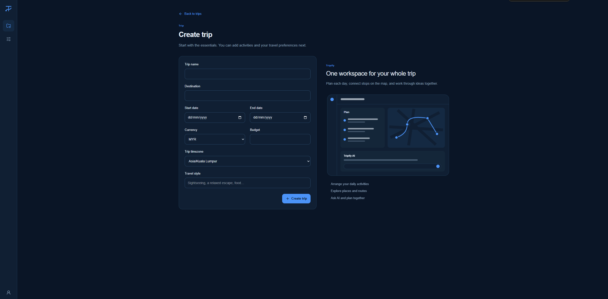

*Trip creation captures the essential parameters: destination, dates, budget, and currency. This isn't just form fields — it's the foundation for every AI decision that follows. Budget constraints inform cost optimization; dates affect seasonality and weather checks; currency ensures accurate financial tracking across international trips. After creation, the trip owner invites members, and each member sets their individual preferences (interests, dislikes, walking tolerance, pace).*

---

#### 7. Plan Your Trip — The Decision Workspace

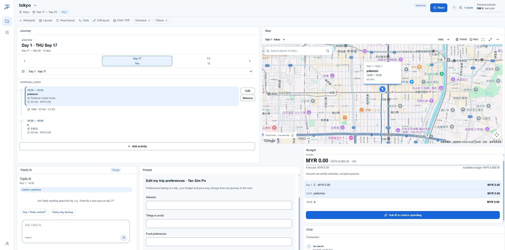

*This is where groups spend most of their time. The three-panel layout combines itinerary timeline (left), interactive Google Maps with routes (center), and AI chat with proposal panel (right). Unlike traditional travel apps where planning is scattered across multiple tools, everything happens in one workspace. The AI participates in the group chat, researches destinations using Google Places and web search, calculates travel times between activities, and proposes schedule optimizations based on real group preferences. When a flight delay or weather change invalidates the plan, the AI detects the problem, researches alternatives, and creates a backup proposal — all within the same interface. This is a decision workspace, not a generic dashboard.*

</div>

<p align="right"><a href="#table-of-contents">↩ Back to top</a></p>

---

## 🚀 4. What Makes It Different

| Feature | What's Original | How It Differs |
|:--------|:----------------|:---------------|
| **Proposal System** | AI creates structured proposals; members vote | No travel app has a proposal/vote layer — this is borrowed from project management (Linear, GitHub PRs) |
| **Group Fit Scoring** | Recommendations scored by group preferences, not individual popularity | Google Travel ranks by generic quality; Tripify ranks by "is this good for OUR group?" |
| **Dynamic Replanning** | AI detects real-world changes and creates backup proposals | Existing apps are static; Tripify treats the itinerary as a living document |
| **Decision Intelligence** | AI analyses WHY someone voted no, then proposes compromise | No app reasons about group disagreements |
| **Version Control** | Every trip change increments a version; proposals are rebased | Prevents stale AI decisions — a problem no travel app addresses |
| **Conditional Backups** | Activities have backup plans triggered by specific conditions | Other apps suggest alternatives, but not tied to specific failure conditions |
| **AI as Teammate, Not Generator** | AI participates in group chat, not just responds to prompts | ChatGPT generates; Tripify collaborates |

<div align="center">

**Dynamic replanning in action:**

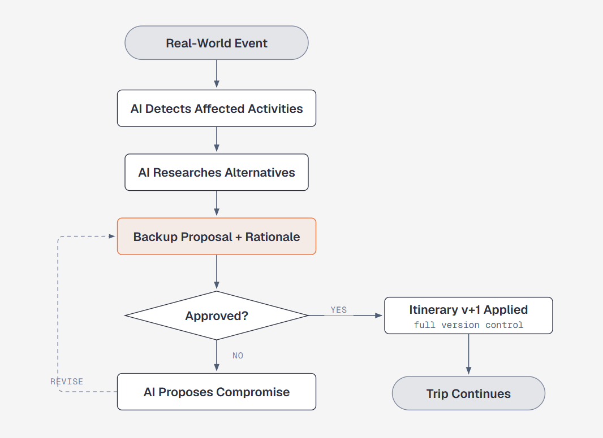

<sub><i>When reality breaks the plan, the loop closes itself — a rejected proposal becomes a compromise, not a dead end.</i></sub>

</div>

<p align="right"><a href="#table-of-contents">↩ Back to top</a></p>

---

## 🛠 5. Technical Architecture & Feasibility

### Tech Stack

| Layer | Technology | Why |
|:------|:-----------|:----|
| **Frontend** | Next.js, React, TypeScript, Tailwind CSS, shadcn/ui, Lucide | Modern React ecosystem; shadcn/ui gives us a polished, accessible component library; TypeScript ensures reliability |
| **Backend** | Next.js API Routes + Server Actions | Collocated with frontend; reduces complexity; no separate server to deploy |
| **Database** | Supabase (PostgreSQL) | Free tier is generous; built-in auth, realtime, and Row Level Security; relational schema supports complex trip state |
| **Auth** | Supabase Auth | Integrated with database; supports email/password and social login; free tier sufficient for hackathon |
| **AI** | OpenRouter + LangChain | OpenRouter gives access to multiple models without vendor lock-in; LangChain provides tool-calling and structured output |
| **Maps** | Google Maps Platform (Places API, Routes API) | Industry standard; accurate for our target destinations; generous free tier for hackathon |
| **Weather** | Open-Meteo | Free, no API key required; sufficient for forecast data |
| **i18n** | next-intl | Purpose-built for Next.js; supports locale-based routing from day one |
| **Hosting** | Vercel + Supabase Cloud | Free tiers; zero-config deployment; global CDN |

<details>
<summary><i>⚠️ Constraints</i></summary>

- Google Maps API has a monthly free tier ($200); sufficient for hackathon, may need monitoring in production
- Supabase free tier limits to 500MB database and 50k monthly active users
- OpenRouter costs depend on model choice; will use cost-effective models (GPT-4o-mini, Claude Haiku) for tool-heavy operations

</details>

### System Architecture

<div align="center">

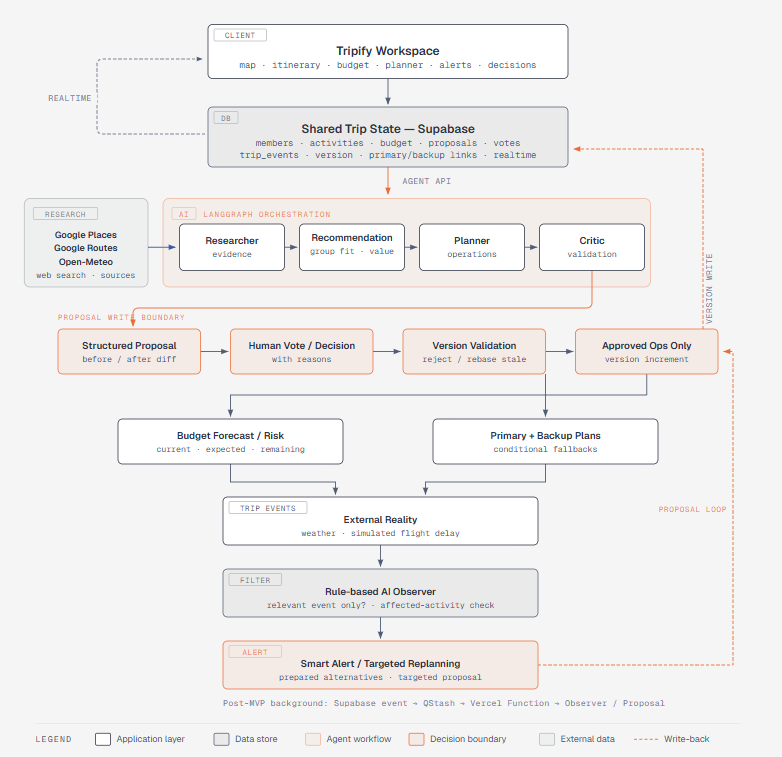

</div>

<details>
<summary><i>Original ASCII version</i></summary>

```
+---------------------------------------------+
|                  Tripify UI                  |
|                                              |
| Chat | Itinerary | Map | Decisions | Budget |
+----------------------+-----------------------+
                       |
                       v
+---------------------------------------------+
|              Next.js Backend                 |
|                                              |
| Auth                                         |
| Trip API                                     |
| Proposal API                                 |
| Vote API                                     |
| AI API                                       |
+----------------+----------------------------+
                 |
        +--------+---------+
        v                  v
+--------------+    +------------------------+
|  Supabase    |    | Tripify AI Agent       |
|              |    |                        |
| PostgreSQL   |    | Research               |
| Realtime     |    | Recommendation         |
| Auth         |    | Planning               |
+--------------+    | Replanning             |
                    +------------+-----------+
                                 |
                                 v
                    +------------------------+
                    | External Tools         |
                    |                        |
                    | Google Places          |
                    | Google Routes          |
                    | Weather (Open-Meteo)   |
                    | Web Search             |
                    | Reviews / Sources      |
                    +------------------------+
```

</details>

### Build Plan & Scope

<div align="center">

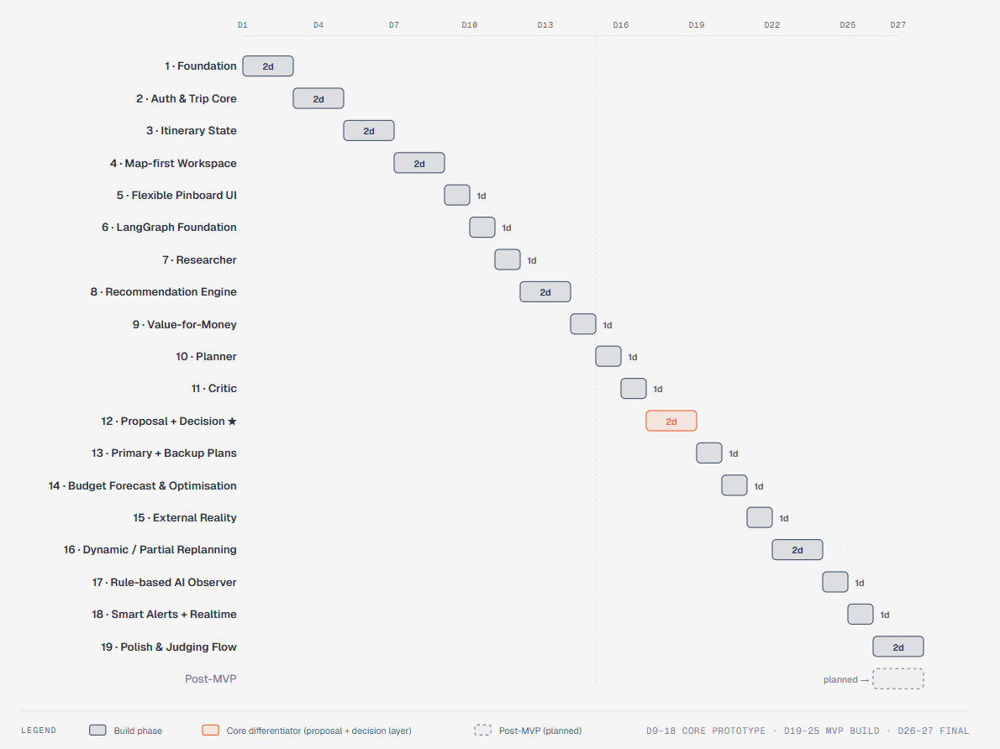

</div>

| Phase | Scope | Days |
|:------|:------|:-----|
| **1. Foundation** | Next.js project, TypeScript, Tailwind, shadcn/ui, next-intl, Supabase setup, ESLint | 1 |
| **2. Auth** | Supabase Auth, login/register/logout, protected routes | 1 |
| **3. Trip Core** | Trip CRUD, members, invite/join, preferences, trip dashboard | 2 |
| **4. Itinerary** | Days, activities, timeline, activity cards, add/edit/delete/reorder | 2 |
| **5. Map** | Google Maps integration, activity markers, route rendering, travel times | 1 |
| **6. Chat** | Chat messages table, chat UI, Supabase Realtime | 1 |
| **7. AI Context** | Context builder (trip, members, preferences, itinerary, budget, chat) | 1 |
| **8. AI Tools** | get_trip, get_preferences, get_itinerary, search_places, get_weather, get_routes, calculate_budget, calculate_group_fit, create_proposal | 2 |
| **9. Proposal System** ⭐ | Proposals table, proposal changes, votes, ProposalCard, ProposalDiff, VotePanel, apply proposal with version control | 2 |
| **10. AI Research & Recommendations** | Web search, Google Places, reviews, recommendation scoring, RecommendationCard | 2 |
| **11. Dynamic Replanning** | Weather integration, flight delay simulation, affected activities detection, backup proposals | 1 |
| **12. Polish & Demo** | Loading states, empty states, error states, responsive layout, mobile layout, demo scenario | 2 |

**What we WILL build:**

- ✅ Complete trip creation and group preference flow
- ✅ Itinerary management with day timeline and activity cards
- ✅ Google Maps integration with routes and travel times
- ✅ Group chat with AI teammate participation
- ✅ AI research, recommendation, and proposal generation
- ✅ Proposal voting with decision intelligence
- ✅ Budget forecasting with AI cost optimisation
- ✅ Flight delay simulation triggering dynamic replanning
- ✅ Weather integration for backup plans
- ✅ Internationalisation (EN, ZH, MS)

**What we will NOT build (deferred):**

- ❌ Hotel/flight booking integration
- ❌ Expense splitting and settlement
- ❌ TikTok/social media crawling
- ❌ Offline mode
- ❌ B2B or travel agency features
- ❌ Custom vector database
- ❌ Multiple independent AI agents

<p align="right"><a href="#table-of-contents">↩ Back to top</a></p>

---

## 🎬 Video & Slides

| | Link |
|:---|:-----|
| **Video Presentation** | [Unlisted YouTube Link] *(title: `Studify` — team name only, per brief)* |
| **Presentation Slides** | [Public Link] *(replace with your share link — e.g. Google Drive / Slides)* |

<details>
<summary><b>📺 Slide preview — all 13 slides</b></summary>
<br/>

<div align="center">

| | |
|:---:|:---:|
| 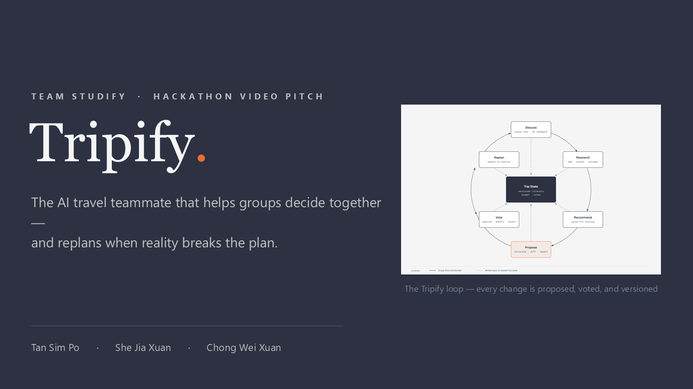 | 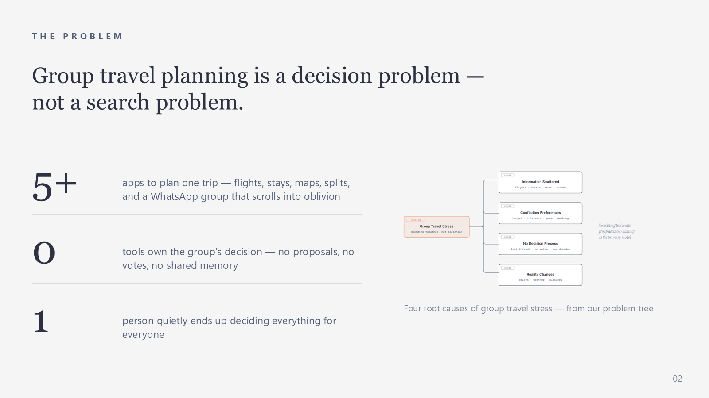 |
| 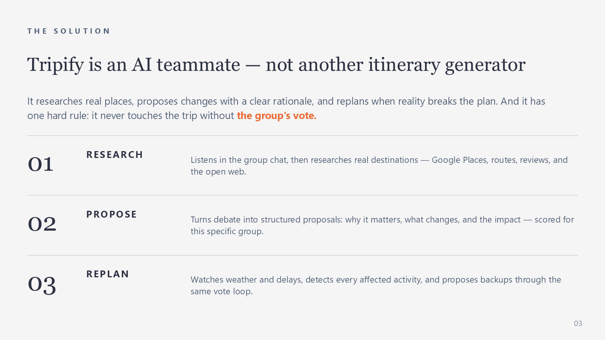 | 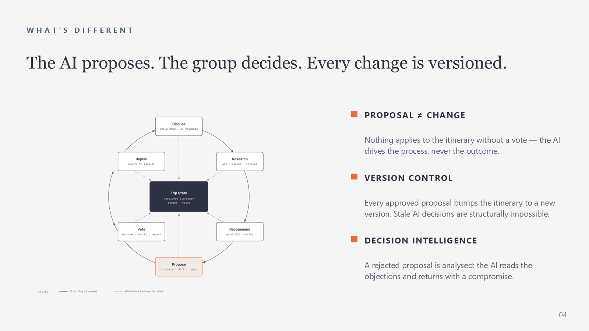 |
| 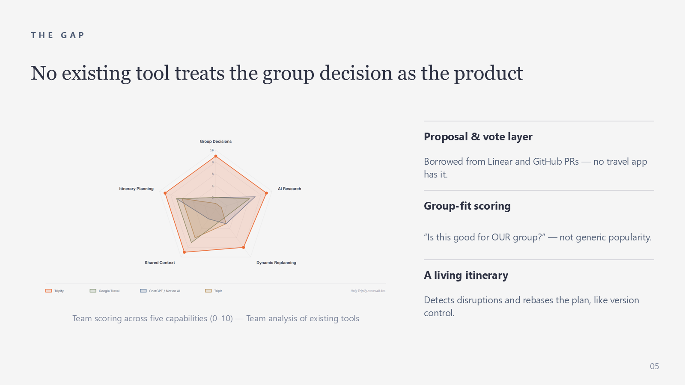 | 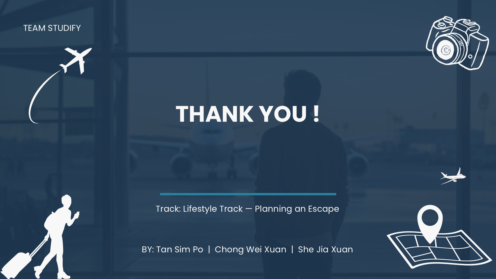 |
| 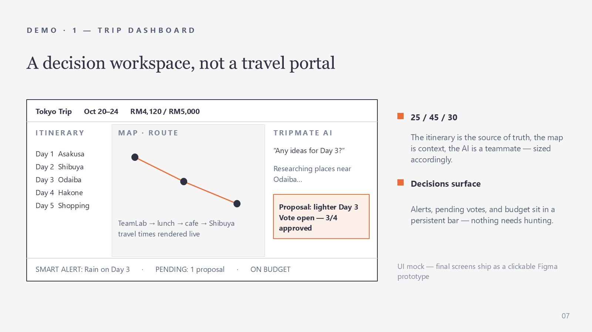 | 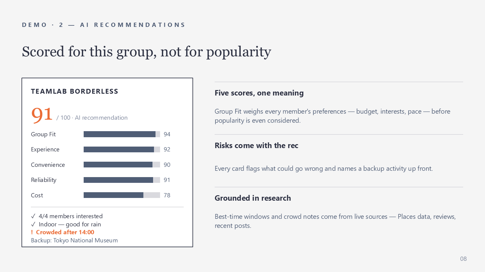 |
| 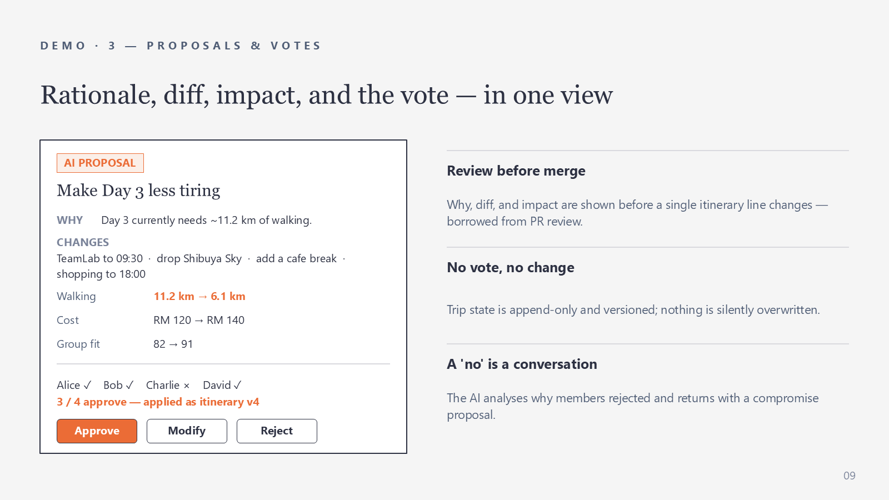 | 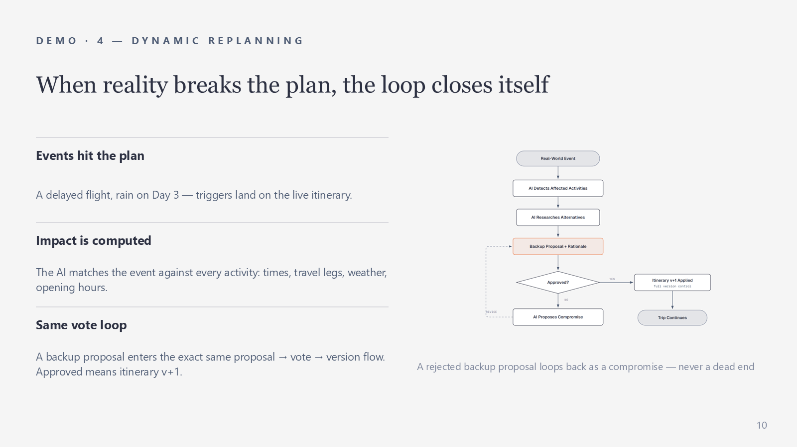 |
| 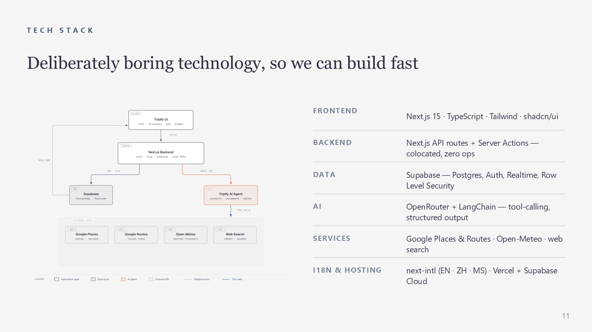 | 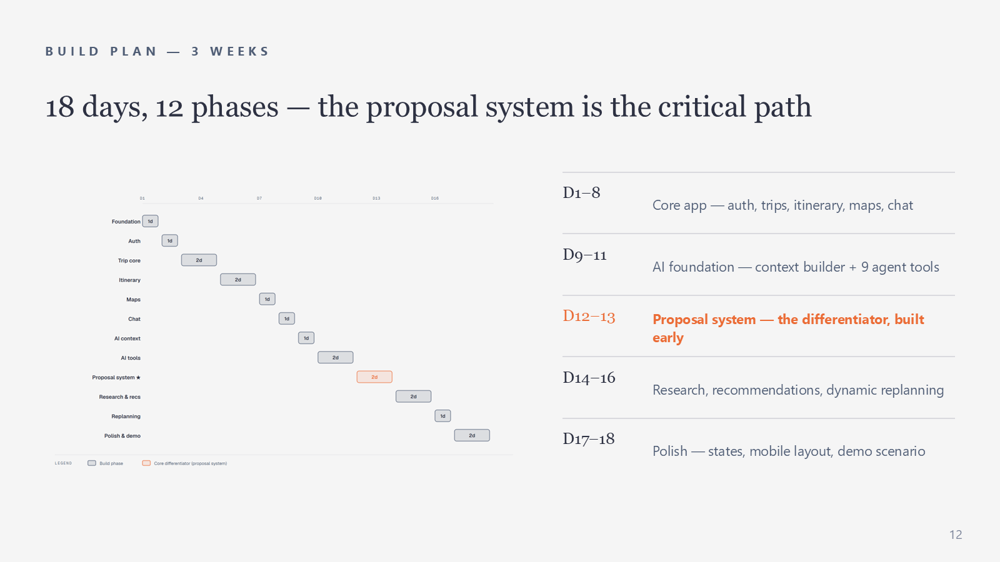 |
| 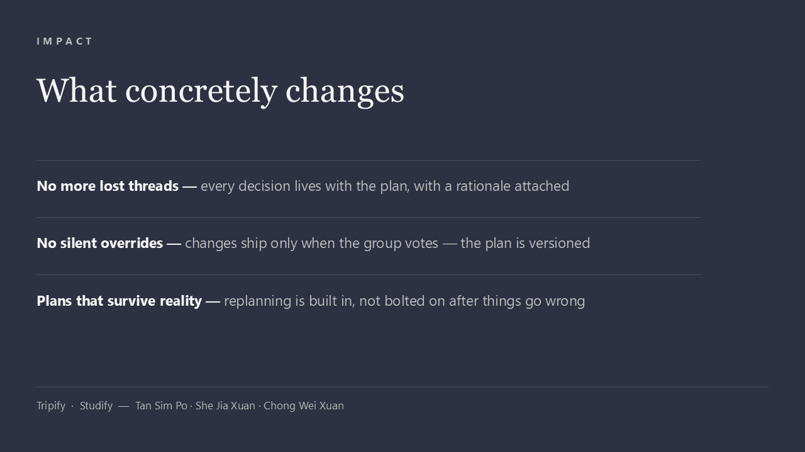 | |

*4:30 video pitch structure: solution & difference → prototype demo → tech stack & build plan → impact & close.*

</div>

</details>

---

## 🧑‍🤝‍🧑 Team

<div align="center">

**Studify**

| | | |
|:---:|:---:|:---:|
| **Tan Sim Po** | **She Jia Xuan** | **Chong Wei Xuan** |

</div>

<div align="center">
<sub><i>Built with ❤️ for group travellers who just want to decide together.</i></sub>
</div>

<p align="right"><a href="#table-of-contents">↩ Back to top</a></p>
